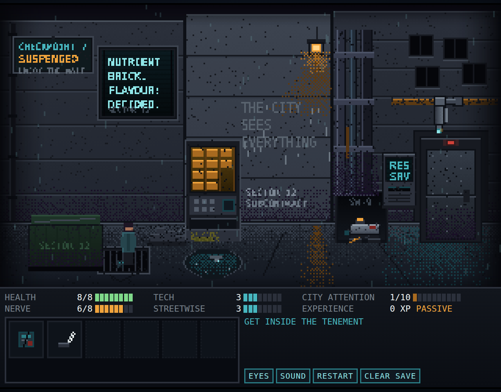

# The City Is Listening

**Checkpoint 7: The Listening Alley** — a single-scene vertical slice of an
original retro point-and-click adventure. Click-to-move navigation, a
multi-step door puzzle with three viable solutions, visible RPG statistics, and
a city that is not quite sure whether it is hunting you or interviewing you.

You are Mara Vey, unlicensed memory courier. Your contact is four floors above a
locked tenement door. The alley belongs to CIVIC.

---

## Run it

```bash
npm install
npm run dev        # http://localhost:5173
```

Production build and preview:

```bash
npm run build      # tsc --noEmit && vite build  ->  dist/
npm run preview    # serves dist/ on :4173
```

Verification:

```bash
npm test           # vitest: 98 unit tests over the pure game logic
npm run playtest   # drives the built game in a real Chromium, writes screenshots
```

`npm run playtest` needs a Chromium. It uses Playwright's own by default
(`npx playwright install chromium` once), or set `CIL_CHROME=/path/to/chrome` to
use one you already have. Add `--headed` to watch it play. Screenshots land in
`playtest-shots/`.

### Poking at it by hand

The game exposes a small debug API on `window.__CIL` for the browser console —
this is what the playtest drives:

```js
__CIL.state()                       // the whole save state
__CIL.objective()                   // the current objective line
__CIL.start('ghost')                // restart as a given build
__CIL.setAttention(9)               // jump City Attention to a tier
__CIL.teleport(287, 170)            // drop Mara somewhere walkable
__CIL.examine('puddle')             // fire a verb without walking there
__CIL.useItem('strip', 'grate')
__CIL.talk('drone'); __CIL.choices() // read the choices currently on screen
__CIL.clearSave()
```

`Tab` in-game outlines every hotspot, its stand point, the walkable band and the
prop footprints — the fastest way to see the scene's geometry.

Stack: TypeScript + Phaser 3 + Vite. No backend, no accounts, no external
services, no asset files — every sprite, cursor, icon and sound is generated in
code at load time.



More: [verbal verification at the terminal](docs/screenshot-verification.png) ·
[the completion panel](docs/screenshot-completion.png)

---

## Controls

| Input | Effect |
| --- | --- |
| Left click on ground | Walk there |
| Left click an object | Walk into range, then do its default action |
| Right click an object | Examine it from wherever you can reach |
| Click an inventory item, then an object | Use the item on it |
| Right click an inventory item | Examine the item |
| Shift+click an item (or click Mara with it selected) | Use it on yourself |
| `Tab` / EYES button | Highlight every hotspot, stand point and blocker |
| `Space` / `Enter` / click | Advance dialogue |
| `1`–`9` | Pick a dialogue choice |
| `Esc` | Close dialogue, or drop the selected item |
| `M` / SOUND button | Mute |

The cursor changes for walkable ground, examinable objects, usable objects,
speech targets, the selected item and invalid targets. The HUD line under the
inventory always names what is under the cursor.

---

## The puzzle: three ways in

The tenement door is opened by the municipal access terminal, which will not
open it for an unregistered citizen. It *will* open it for municipal service
credentials — and a service badge is sitting under the drain grate, expired and
with its holder field burned blank.

Every route needs the badge, and the badge needs a tool:

1. Examine the **nutrient dispenser** — it is jammed and leaking.
2. Operate it. A Tech or Streetwise check (whichever is higher, +1 for having
   looked at it) gets the anti-theft strip out cleanly. Failing that, **use the
   ceramic knife** on the fascia: noisy, +1 City Attention, but it always works.
3. **Use the magnetic retrieval strip on the grate** to fish out the badge.
   (Reaching in by hand first costs 1 Health and teaches you why.)

### Path A — Technical

Favours Tech. Neutralise the camera, then forge a holder.

4. **Talk to SW-9**, the maintenance drone. Ask about its tread (Tech ≥ 4) or
   tell it that it is allowed to be frightened — either way you learn that the
   coupling releases if the recess catch is pressed first.
5. **Repair it.** TECH vs 5, +2 for the drone's advice, +1 for carrying the
   knife. It hands over its **diagnostic key**, which carries a live work order.
6. **Use the key on the terminal.** Maintenance mode: the camera above the door
   turns to face the wall and counts tiles for 60 seconds. City Attention −2.
7. **Use the cracked identity shard on the service badge.** TECH vs 5, +2 for
   the live work order to anchor the graft, +1 for knowing what the holder field
   wants (examine the terminal).
8. **Use the spliced badge on the terminal** inside the calibration window. The
   lamp goes amber. **Click the door.**

### Path B — Streetwise

Favours Streetwise and careful reading. Don't beat the bureaucracy; be it.

4. Read the **works stencil** at knee height (Sector 12) and look at the
   **drone** (unit SW-9).
5. **Talk to the terminal** and report the dispenser fault. FAULT 4471 is queued
   against unit SW-9. City Attention −1: filing paperwork is the most ordinary
   thing you can do in this district.
6. **Use the badge on the terminal.** An expired badge plus a live fault gets
   you verbal verification — three questions:
   - *State your subcontract sector.* "Sector Twelve", or deflect with
     "whichever one has the leaking dispenser in it" (STREETWISE vs 4, +2 if you
     read the stencil).
   - *Identify the unit named on the supervising fault.* "Unit SW-9", or bluff
     it (STREETWISE vs 5, +2 if you have met SW-9).
   - *Explain the blank holder field.* NERVE vs 4 (or vs 5 for the bolder
     answer, +2 at Nerve 6). +1 if you serviced SW-9, −1 if the terminal already
     disbelieves you, +1 per previous attempt.
7. CIVIC decides that an unattended fault is more anomalous than an open door.
   **Click the door.**

### Path C — Honest (hidden)

Not signposted. It requires noticing that the wall is answering.

- The **graffiti** reads `THE CITY SEES EVERYTHING`. After you have read it and
  then done something else in the alley, it reads `EVERYTHING SEES THE CITY`.
  After the next thing, it uses your name.
- **Speak to the graffiti** (or the drain). Once the wall has used your name,
  you have spoken with SW-9 more than once, and you have talked to the city
  twice, CIVIC stops performing and asks you a question:
  *"Whose memory would you refuse to carry?"*
- The considered answer works for any build (NERVE vs 3). The bold one —
  *"Yours"* — needs NERVE vs 5. Lying about it gets you caught, costs
  attention, and CIVIC asks again.
- CIVIC revises its opinion of the latch, the wall changes one last time, and
  City Attention withdraws.

**Telling the terminal the truth** during Path B's third question is a fourth
outcome: it is not a win, but CIVIC tells you where to say it instead, and
lowers your attention for the honesty.

All three paths are completable by all three starting builds — the tests and the
browser playtest verify this on every run. The easiest route differs:

| Build | Tech | Streetwise | Nerve | Path of least resistance |
| --- | --- | --- | --- | --- |
| Ghost Technician | 6 | 2 | 4 | A — everything mechanical lands first try |
| Alley Diplomat | 2 | 6 | 4 | B — talks past both checks without preparing |
| Burned Courier | 3 | 3 | 6 | C — Nerve carries the bold answer; A and B need homework |

---

## How each statistic changes the scene

**Health 8/8** — Deliberately light, as specified. One optional mistake costs
it: reaching into the drain grate bare-handed (−1, once, and it teaches you that
you need a tool).

**Nerve** — Gates the final social beat and the walk through a watched door.
Tiers 3 and 4 of City Attention each cost 1 Nerve permanently: a sloppy approach
literally makes Mara's hands less steady for the conversation at the end. The
nutrient brick restores 2. Low Nerve never blocks the scene — failing the door
check grants a stacking "you have already stood here once" bonus.

**Tech** — Reading the camera's duty cycle by eye (vs 5, +2 if you timed it in
the puddle instead), opening the dispenser cleanly, diagnosing the drone's tread,
repairing it (vs 5), splicing the credential (vs 5).

**Streetwise** — Recognising that the works stencil means an outside crew works
this door, the dispenser's bad habit, and both bluffs at the terminal. At
Streetwise ≥ 4 the stencil tells you more than it says.

**City Attention 1/10** — See below.

**Experience** — Awarded for discoveries (10–15), puzzle steps (15–30),
alternate solutions, helping the drone (30), CIVIC's question (40) and getting
inside (50). Displayed as toasts. A thorough Path A run scores around 230 XP.

---

## What the city does with your attention

Rises on: repeated failed credential scans (+1, +2 once suspicious, then it gets
bored and stops caring); loitering in the camera's zone while the lens covers it
(+1 per 4.5s); prising the dispenser open (+1); reaching into the drain in view
(+1); shoving the drone (+1); broadcasting a malformed credential (+2); a
crooked checksum (+1); contradicting your own badge (+2); staring up at the
camera (+1); freezing in an unlatched doorway (+1).

Falls on: standing behind the refuse hopper, out of every line of sight (−1 per
5s, floor 1); filing a genuine fault report (−1); servicing SW-9 (−1); opening a
maintenance window with a real work order (−2); telling the terminal the truth
(−1).

| Attention | What changes |
| --- | --- |
| 1–3 PASSIVE | The camera runs its patrol: sweep, hold three seconds facing away, return. Ads sell nutrient bricks. The drain mutters every 26s. |
| 4–6 ATTENTIVE | The camera stops patrolling and tracks Mara — the blind interval is gone until you make one. Ads use her name. Windows blink open like eyes. The hum comes up, the sub-bass "breathing" starts. |
| 7–8 SUSPICIOUS | The terminal doubts her specifically (−1 on the social check). Nerve −1. Whispers every 14s. Failed scans now cost 2. The view cone brightens. |
| 9 CRITICAL | A sweep advisory. Nerve −1 again. Ads turn hostile and red. The camera cone goes red, its lamp strobes. Walking through an unlatched door now needs a NERVE check. |
| 10 SATURATED | A sanitation sweep relocates Mara to the mouth of the alley. Nothing is lost — items, flags, XP and discoveries all survive — but attention resets to 5, the calibration window closes, and an unlatched door relocks. |

The camera and door both show state: the camera's lamp is cyan on patrol, amber
while it covers the apron, red once it is alert, dim during calibration. The
door lamp is red (locked and monitored), pulsing amber (temporarily
disconnected) or green (open). Both temporary windows last 60 seconds and are
repeatable if they close.

Five distinct reactions are the requirement; the playtest verifies seven.

---

## Save and reset

The scene autosaves to `localStorage` after every action and every ambient
change: items, puzzle stages, statistics, examined objects, dialogue choices
taken, and the door state. The title screen offers CONTINUE when a save exists.
RESTART returns to the start of the scene with the same build; CLEAR SAVE erases
it and returns to build select. There is no multi-slot system.

`deserialize()` is deliberately paranoid: unknown items, hotspots, profiles,
door states and win paths are dropped, statistics are clamped, and impossible
combinations are repaired rather than loaded (a save claiming `gotBadge` with no
badge in the inventory gets the badge back; a door claiming to be open with
nobody having entered is relocked). A save from a different version, a truncated
write, or a storage backend that throws all degrade to "start a new scene".

---

## Architecture

`src/game/` is pure logic with no Phaser and no DOM, which is what the unit
tests exercise:

| File | Responsibility |
| --- | --- |
| `game/types.ts` | Shared vocabulary: items, hotspots, flags, effects, reactions |
| `game/state.ts` | The save shape and a fresh game |
| `game/stats.ts` | Starting profiles, the one clamped path for every stat write |
| `game/attention.ts` | City Attention tiers and their behavioural profiles |
| `game/checks.ts` | Deterministic stat checks with readable modifier notes |
| `game/engine.ts` | Every verb, every puzzle transition, every dialogue branch |
| `game/nav.ts` | Walkability grid, A*, string-pulled paths |
| `game/save.ts` | Serialise, validate, repair, clear |
| `data/scene.ts` | Geometry: ground band, blockers, hotspot rects and stand points |
| `data/lines.ts` | Prose: examine text, barks, whispers, failure messages |
| `data/items.ts` | Item definitions |
| `art/painter.ts` | Pixel primitives: dithered gradients, thresholded bitmap type |
| `art/textures.ts` | Every sprite, cursor and item icon, drawn at boot |
| `audio/sfx.ts` | Synthesised rain, hum, breathing and eleven one-shots |
| `scenes/AlleyScene.ts` | Rendering, input, movement, camera behaviour, weather |
| `ui/*.ts` | HUD, dialogue box, modals, integer-scale layout |
| `main.ts` | Wires the engine to the scene and the interface |

The engine never touches the screen. A player action returns a `Reaction`
(lines, toasts, effects, an optional check result and an optional prompt) and the
presentation layer plays it. That is what makes both the unit tests and the
scripted browser playthroughs possible.

### Visual approach

320×180 internal resolution, integer-scaled (`--u` drives both the canvas zoom
and every CSS dimension, so the HTML interface lands on whole pixels with the
canvas). Limited palette in `art/painter.ts`: wet concrete, dirty cyan, sodium
amber, warning red, violet shadow. Gradients and light falloff use a 4×4 Bayer
dither so they stay pixel-art instead of turning into static. Text inside the
scene is rendered through the system monospace font and hard-thresholded to 1-bit,
which produces genuine low-resolution type at this size. Seeded randomness, so
the art is identical on every load.

---

## Known limitations

- **One scene, on purpose.** No second room, no combat, no economy, no
  levelling beyond the XP counter.
- **Mouse and keyboard only.** No touch controls; hotspots are 320×180-scale
  rectangles and there is no gamepad support.
- **Bundle size.** ~1.3 MB of JavaScript, essentially all Phaser. Fine for a
  local slice; a real release would tree-shake a custom Phaser build.
- **Audio is synthesised and plain.** Rain, hum, a breathing sub-bass and eleven
  one-shot blips. There is a mute button and a volume setter but no volume
  slider in the HUD.
- **Text scaling is CSS-based, not bitmap.** Interface text is crisp system
  monospace sized in virtual pixels rather than a hand-drawn pixel font, so it
  is sharper than a period-accurate HUD would be. In-scene text (signs, screens,
  graffiti) *is* 1-bit pixel type.
- **The terminal screen holds five characters per line.** It is 16 scene pixels
  wide, so it speaks in abbreviations (`MNT`, `4471`, `TEMP OPEN`).
- **No accessibility pass.** No colour-blind palette option, no text-size
  control, no screen-reader support for the canvas.
- **The maintenance and temporary-access windows are 60 seconds.** Generous, but
  a player who wanders off will have to repeat the last step.

Further ideas that were deliberately *not* built are in
[FUTURE_IDEAS.md](FUTURE_IDEAS.md).
